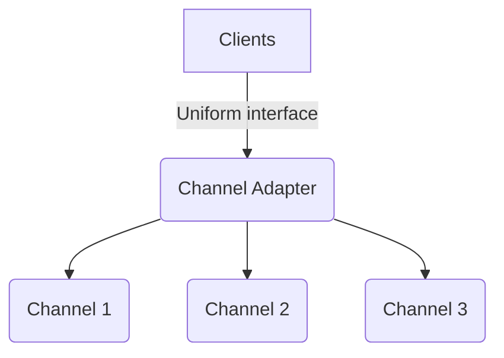
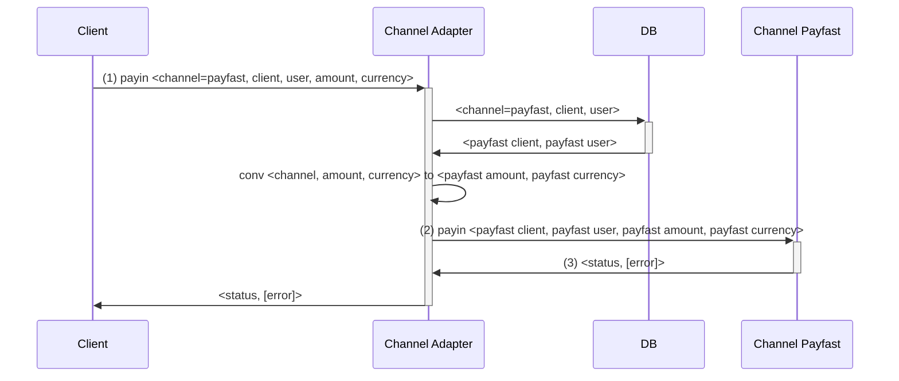

You have joined the team for a few weeks, and this is your first on call period.

The team is in charge of a "Channel Adapter" service
which translates payment requests from upstream clients
to the specific interfaces of different payment channels
that the company integrated with.






We serve 3 clients, support 2 types of currency (Singapore and US Dollars) and have around a million users.

Ops just notified you that they observe a drop in payment success rate for a channel called Payfast.


Unfortunately, our own metrics platform is also down, so the only option available
is SSH-ing into Channel Adapter server and analyze the log.
What we have is 1h of log during normal period and 1h of log during the incident.

You need to use the available log to diagnose probable causes and decide what to do next.
You can use any tools you want e.g. Google search, AI, online/offline tools, writing custom scripts, etc.

Clock is ticking, customers are complaining, money is bleeding. Go!


--------------------------------------------------------------------------------------------------------


Each log line is a list of key=value, separated by a space ` `,
with a mandatory key `event` being the event name,
and the rest KVs are attributes specific to each event.
For the sake of simplicity, we assume the values never contain spaces.

The service outputs the following events to log:

* (1) payin_request_received
    * transaction
    * client
    * user
    * amount
    * currency

* (2) payfast_payin_request_sent
    * transaction
    * body: body of the request sent to payment channel, for Payfast it's a json encoded

* (3) payfast_payin_response_received
    * transaction
    * body: body of the response received from payment channel, for Payfast it's a json encoded
    * payfast_response_time_ms

* (4) payin_responded
    * transaction
    * status: transaction status
    * reason: failure reason, if the status is failed
    * processing_time_ms

Example:

```
event=payin_request_received transaction=40ee91dd-f878-405c-81be-497f9cb88dc6 client=client_1 user=user_82193 amount=28 currency=SG
```
